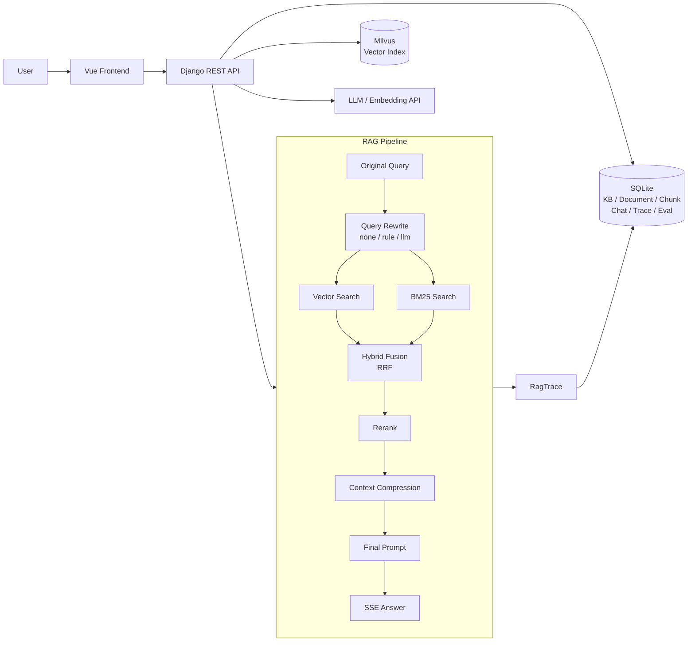

# AIAssistant

AIAssistant 是一个一期 RAG 知识库问答、可视化调试和评测管理系统。它从 AIFriends 的对话能力中拆分出来，先把“上传知识文档 -> 切片 -> 建索引 -> 检索 -> 压缩上下文 -> 流式回答 -> 评测 -> 失败沉淀回归集”这条闭环做扎实，后续再在这个基础上升级 Agent、Function Calling 和工具调用。

## 当前定位

一期不是泛聊天机器人，而是一个可调试、可评测、可长期演进的 RAG 系统：

- 给用户提供知识库和文档上传能力。
- 支持多种切片策略，并在前端直观看到切片效果。
- 使用 Vector Search、BM25、Hybrid Fusion、Rerank、Context Compression 组成完整 RAG 链路。
- 将每次问答的检索、重排、压缩、最终 Prompt、最终回答保存为 Trace。
- 将评测基准、评测结果、失败原因和回归集维护在数据库中。
- 在前端提供调试工作台，让参数变化对每一层结果的影响可见。

## 技术栈

- 后端：Django、Django REST Framework、SimpleJWT、SQLite。
- 前端：Vue 3、Vite、Pinia、Vue Router。
- 检索：Milvus Vector Search、SQLite 中的 Chunk 元数据、BM25 词法检索。
- 大模型：通过 `.env` 中的 OpenAI-compatible 配置调用聊天、Embedding、可选 LLM Rewrite / LLM Compression。
- 评测：RAGAS 命令、Django 后台轻量线程、SQLite 持久化评测 Run 和 Case Result。

## 目录结构

```text
AIAssistant/
├── AGENTS.md                 # 给 coding agent 的项目级工作指南
├── README.md                 # 项目能力、架构、启动与维护说明
├── 一期功能说明.md            # 面向学习和上手的中文功能说明
├── backend/
│   ├── manage.py
│   ├── assistant_backend/     # Django project settings
│   ├── rag/                   # RAG 业务、API、检索、评测、管理命令
│   └── vector_store/          # 本地可重建向量相关数据
├── frontend/
│   ├── package.json
│   └── src/                   # Vue 前端页面、API、状态管理
└── scripts/                   # 辅助脚本
```

## 系统架构



## RAG Pipeline

当前问答链路如下：

```text
Original Question
-> Query Rewrite
-> Vector Search + BM25 Search
-> Hybrid Fusion (RRF)
-> Rerank
-> Context Compression
-> Final Prompt
-> LLM Streaming Answer
-> RagTrace 持久化
```

支持能力：

- Query Rewrite：`none`、`rule`、`llm`，默认 `rule`。
- Chunking：Token、句子、句子窗口、语义、Markdown，默认句子切片。
- Retrieval：Milvus 向量检索 + BM25 关键词检索。
- Hybrid：使用 RRF 合并 Vector 和 BM25 候选。
- Rerank：对 Hybrid Top N 重新排序，并展示前后变化。
- Compression：展示压缩前、压缩后、token 节省比例和关键句保留情况。
- SSE：右侧对话栏流式输出回答。

## 前端工作台

前端主界面分三列：

- 左侧：知识库、文档、索引、重置、用户操作。
- 中间：调试工作台。
- 右侧：RAG 对话栏，支持 SSE 流式输出。

中间“调试工作台”按产品视角拆成四个选项卡：

- `Debug`：切片实验室、RAG 检索调试、参数调整。
- `Evaluation`：运行评测、查看评测报告、Run 对比、Failure Analysis。
- `Datasets`：维护评测集、基准问题、回归用例。
- `History`：查看历史 Trace、Trace 详情、Trace 对比、一键沉淀回归用例。

中间列和右侧对话栏支持左右拖动调整宽度，页面内部区域独立滚动。

## 参数可视化

调试工作台支持调整并观察这些变量：

- `chunk_size`
- RAG `top_k`
- BM25 `top_k`
- `RRF_K`
- Rerank `top_n`
- Compression 策略
- Query Rewrite 策略

用户调一次参数，就能在前端看到切片、Vector、BM25、Hybrid、Rerank、Compression、Final Prompt 等环节结果如何变化。

## 评测管理

系统已经从简单 JSON 示例升级为数据库中的评测集管理。

`RagBenchmarkCase` 保存：

- `question`：评测问题。
- `reference`：标准参考答案。
- `expected_terms`：期望命中的关键词。
- `target_chunk_ids`：标准答案所在 chunk。
- `suite`：所属评测集，例如 `smoke`、`benchmark`、`regression`、`release`。
- `tags`：标签。
- `difficulty`：难度。
- `source`：来源，例如专家维护、Trace 沉淀、Eval Failure 沉淀、默认 JSON。
- `notes`：维护备注。
- `enabled`：是否启用。

`RagEvalRun` 保存一次评测运行的参数组合、状态和汇总指标。

`RagEvalCaseResult` 保存每个 Case 的详细结果，包括：

- RAGAS 指标。
- Vector / BM25 / Hybrid / Rerank 各阶段是否命中目标 chunk。
- Recall@K、Hit Rate、MRR。
- Compression 是否保留关键句。
- 最终回答是否正确。
- 失败原因标签。

前端可以选择评测集并直接运行评测，后端启动轻量后台线程，前端拿到 Run ID 后轮询状态。

## Failure Analysis

评测报告会把失败 Case 按原因分组：

- `rewrite_failed`：问题改写导致检索意图偏离。
- `vector_miss`：向量召回没有命中目标 chunk。
- `bm25_miss`：BM25 没有命中目标 chunk。
- `hybrid_drop`：Vector 或 BM25 命中了，但 Hybrid Fusion 后丢失。
- `rerank_drop`：Hybrid 命中了，但 Rerank 后没有保留在 Top N。
- `compression_lost`：Rerank 命中了，但压缩后丢失关键句。
- `llm_answer_wrong`：上下文足够但最终回答不正确。
- `no_reference`：没有参考答案，无法判断正确性。
- `target_chunk_stale`：目标 chunk 已过期或不存在。

这些失败原因来自每个评测 Case 的阶段性诊断结果，而不是只看最终 RAGAS 分数。

## 闭环能力

系统支持从真实失败中沉淀回归集：

- 从历史 Trace 一键生成 Regression Case。
- 从 Eval Failure 一键生成 Regression Case。
- Regression Case 进入 `regression` suite。
- 后续每次参数调整、切片策略调整、模型调整后，都可以重新跑 regression，确认老问题没有被修坏。

这让系统具备长期向好的演进能力。

## 核心 API

常用能力包括：

- Auth：注册、登录、当前用户信息。
- Knowledge Bases：知识库创建、查询、切换。
- Documents：上传文档、切片预览、索引、查看 chunks。
- Chat Sessions / Messages：创建会话、历史消息、SSE 流式问答。
- Rag Traces：Trace 列表、Trace 详情、Trace 对比。
- Rag Benchmark Cases：评测 Case 列表、创建、编辑、删除、导入默认样例、从 Trace 沉淀、从 Eval Failure 沉淀。
- Rag Eval Runs：评测 Run 列表、详情、启动后台评测、轮询状态、Run 对比。
- Reset Workspace：清空 SQLite 业务数据和向量库 chunk，恢复到初始状态。

## 数据库保存什么

主要模型包括：

- `KnowledgeBase`：知识库。
- `Document`：上传文档。
- `Chunk`：文档切片、文本、元数据、embedding 相关信息。
- `ChatSession`：对话会话。
- `ChatMessage`：用户和助手消息。
- `RagTrace`：一次问答的全链路调试记录。
- `RagBenchmarkCase`：评测基准和回归用例。
- `RagEvalRun`：一次评测运行。
- `RagEvalCaseResult`：单个 Case 的评测结果。

Milvus 负责向量检索，SQLite 负责业务数据、调试记录和评测结果。

## 环境变量

后端读取 `backend/.env`。常用配置包括：

```text
API_KEY=...
API_BASE=...
CHAT_MODEL=...
EMBEDDING_MODEL=...
EMBEDDING_DIMENSIONS=...
```

可选配置包括：

```text
DASHSCOPE_API_KEY=...
DEEPSEEK_API_KEY=...
MILVUS_URI=...
MILVUS_COLLECTION=...
```

实际变量名以 `backend/.env.example` 和代码中的 settings 为准。

## 启动方式

后端：

```bash
cd /home/peng/AIAssistant/backend
source venv/bin/activate
python manage.py migrate
python manage.py runserver 127.0.0.1:8010
```

前端：

```bash
cd /home/peng/AIAssistant/frontend
export PATH=/home/peng/.local/node-v20.19.0-linux-x64/bin:$PATH
npm install
npm run dev -- --host 0.0.0.0 --port 5174
```

访问：

```text
http://localhost:5174
```

## 常用验证命令

后端：

```bash
cd /home/peng/AIAssistant/backend
source venv/bin/activate
python -m compileall rag
python manage.py check
python manage.py makemigrations --check --dry-run
```

前端：

```bash
cd /home/peng/AIAssistant/frontend
npm run build
```

## Agent 化演进方向

一期先把 RAG 闭环做好。二期可以在当前能力上扩展为 Agent：

- 保留 RAG Pipeline 作为知识工具。
- 增加工具注册和 Function Calling。
- 增加任务规划、工具执行 Trace、人工确认节点。
- 增加 Agent Eval，把工具调用正确性、任务完成率、成本和延迟纳入评测。

也就是说，当前系统不是 Agent 的替代品，而是未来 Agent 的知识检索、调试和评测底座。
