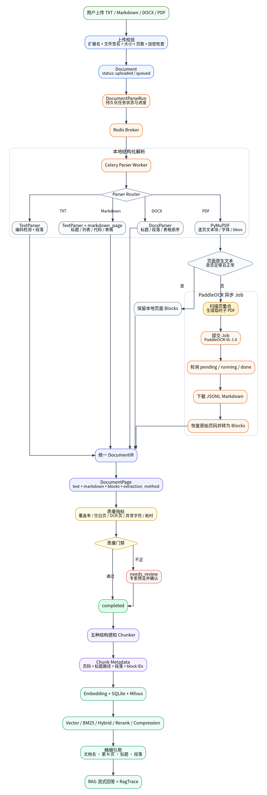

# AIAssistant

AIAssistant 是一个面向 RAGOps 的知识库问答、调试、评测和 Agent 工作流系统。项目最初从 AIFriends 的对话能力中拆分出来，一期先把 RAG 问答链路做成可观察、可调参、可评测、可回归的工程闭环；二期在这个底座上引入 LangGraph Agent、Human-in-the-loop 和自动化诊断工作流。

当前项目不是一个普通“上传文档然后聊天”的 Demo，而是一个用于学习和演示 RAG 工程化演进的系统：

- 用户可以上传 TXT、Markdown、DOCX、PDF；系统先解析、质检和预览，再进行结构感知切片与索引。
- 系统会先通过 Query Router 判断问题是否属于内部知识库，实时/联网类问题会被显式拦截。
- 长对话会异步生成 Session Summary，后续问题改写会结合摘要和最近几轮消息。
- 开发者可以看到 Query Router、Conversation Memory、Query Rewrite、Vector、BM25、Hybrid、Rerank、Compression、Final Prompt 每一层发生了什么。
- 专家可以维护评测集，运行冒烟、基准、回归、发布评测。
- 系统可以把 Trace、用户反馈、评测失败沉淀成 Regression Case。
- Agent 可以围绕一次失败问答或失败评测，执行端到端 RAG 修复工作流，并在写操作前等待人工确认。

## 当前能力地图


## 核心闭环详解

### RAG 问答与可观测链路

这条链路展示一次知识库问答从用户问题进入系统后，如何经过 Query Router、会话记忆、Query Rewrite、Vector/BM25/Hybrid/Rerank、上下文压缩和最终 Prompt，并把每个阶段写入 Trace，支撑后续调试、评测和回归。


### 评测与回归闭环

评测闭环展示专家 Eval Case 如何按 suite 运行，结合 RAGAS、deterministic checks 和 LLM-as-Judge 生成 Case Result 与 Failure Analysis，再把失败样例、坏 Trace 和用户负反馈沉淀为 Regression Suite，驱动下一轮优化。


### RAGOps Agent 修复闭环

Agent 修复闭环展示系统如何围绕失败 Trace 或 Baseline Eval Run 收集证据、诊断失败阶段、生成优化方案，并通过 Human-in-the-loop Action Card 审批后创建回归样例或运行参数实验计划，形成可审计的自动化修复流程。


## 技术栈

- 后端：Django、Django REST Framework、SimpleJWT、SQLite、pytest。
- 前端：Vue 3、Vite 7、Element Plus、Pinia、TypeScript。
- 文档解析：PyMuPDF、python-docx、charset-normalizer、PaddleOCR Job API、统一 Document IR。
- 异步任务：Celery + Redis 统一负责文档解析/索引、会话摘要、RAG 评测、解析评测和 Agent 参数实验。
- 检索：Milvus Lite 向量索引、SQLite Chunk 元数据、BM25。
- RAG：Query Router、Session Summary Memory、Query Rewrite、Hybrid Search、Rerank、Context Compression、SSE Streaming。
- 评测：RAGAS、Celery Eval Run、Run 对比、Failure Analysis。
- Agent：LangGraph、SQLite checkpointer、LangGraph 原生 interrupt/resume、HITL Action Card、Agent 审计记录。
- 模型：通过 `backend/.env` 中的 OpenAI-compatible 配置调用聊天、Embedding、Rerank、Rewrite、Compression。

## 生产化边界与后续演进

这个仓库定位是 RAGOps 学习与工程化演示项目，强调 RAG 链路可观测、可评测、可回归和 HITL 修复闭环；默认配置优先服务本地开发与演示。若要进入生产环境，建议按以下方向演进：

- **配置与密钥安全**：本地开发通过 `backend/.env` 读取模型和向量库配置；生产环境应关闭 `DEBUG`、使用强 `SECRET_KEY`、限制 `ALLOWED_HOSTS/CORS_ALLOWED_ORIGINS`，并通过密钥管理系统注入 API Key，避免写入日志或提交到仓库。
- **任务队列与可靠性**：解析、索引、摘要、RAG/解析评测和 Agent 实验已统一进入 Celery；任务保存 queued/running/completed/failed、task ID、心跳、错误和重试信息，Redis/Worker 不可用时 API 明确失败。
- **数据与向量存储扩展**：当前默认 SQLite + Milvus Lite 便于本地复现；生产环境可迁移到 PostgreSQL + Milvus Server/Zilliz Cloud，并增加索引重建、向量库与业务库一致性校验、备份恢复流程。
- **上传与访问控制**：当前已实现大小、类型、文件签名、PDF 页数/加密和 DOCX Zip Bomb 校验，并保持 owner 级 API 过滤；生产环境仍应增加恶意文件扫描、对象存储隔离、配额和数据出域审计。
- **LLM-as-Judge 风险控制**：Judge 输出应经过 JSON Schema 校验、分数范围 clamp 和 parse failure 记录；Prompt 中应明确忽略被评估答案或引用内容里的指令，避免 prompt injection 影响评分。
- **关键链路不静默降级**：Embedding、Vector Search、Rerank 等影响答案可靠性的关键步骤失败时，应明确提示并写入 Trace/ModelCallLog，而不是伪装成低质量答案继续返回。
- **测试与 CI 门禁**：后端应持续覆盖 Query Router、Hybrid、Case Factory 幂等、Deterministic Scorer、Agent Action 状态流转等核心路径；前端应运行 `npm run typecheck` 和 `npm run build`，避免类型债重新积累。
## 目录结构

```text
AIAssistant/
├── AGENTS.md
├── README.md
├── 一期功能说明.md
├── 二期功能说明.md
├── backend/
│   ├── manage.py
│   ├── assistant_backend/
│   └── rag/
│       ├── agent/              # LangGraph RAGOps Agent（graph / tools / actions / checkpointing）
│       ├── tests/              # Parser、OCR、API、切片、评测与 RAG 核心测试
│       ├── migrations/
│       ├── services.py         # RAG 主链路 facade（re-export）
│       ├── chat_pipeline.py    # 问答编排
│       ├── retrieval.py        # 检索与 rerank 编排
│       ├── session_memory.py   # 会话摘要记忆
│       ├── document_parsing/   # Parser、统一 IR、上传校验、PaddleOCR 与解析服务
│       ├── tasks.py            # Celery 文档解析任务
│       ├── indexing.py         # 基于 Parse Run 的切片、Embedding 与索引切换
│       ├── hybrid.py           # RRF 融合
│       ├── query_router.py
│       ├── query_rewrite.py
│       ├── eval_runs.py        # Eval Run stale 检测
│       ├── case_factory.py
│       ├── experiments.py
│       └── views.py
└── frontend/
    ├── src/
    │   ├── App.vue             # 工作台壳层
    │   ├── main.ts
    │   ├── api/                # TypeScript API 客户端
    │   ├── composables/        # useAgent / useChat / useEvalRuns 等
    │   ├── stores/             # Pinia（auth 等）
    │   ├── types/
    │   └── components/
    └── package.json
```

## 一期：RAG 系统做了什么

一期目标是把 RAG 链路做成可持续优化的工程系统。

核心能力：

- 知识库管理：创建知识库、上传文档、查看文档和 chunk。
- 五种切片方式：Token、句子、句子窗口、语义、Markdown。
- 向量索引：Chunk 写入 SQLite，Embedding 写入 Milvus Lite。
- Query Router：识别 `internal_knowledge` 和 `web_required`，需要联网/实时信息的问题不会硬查内部知识库。
- 多轮对话：基于当前 ChatSession 最近几轮消息做 Conversational Query Rewrite，解决“他/这个/刚才那个”等指代问题。
- 会话摘要记忆：长对话达到阈值后由 Celery 生成 Session Summary，后续问题改写会结合摘要和最近几轮消息。
- 混合检索：Vector Search + BM25 Search，通过 RRF 做 Hybrid Fusion。
- Rerank：对 Hybrid 候选重新排序。
- Context Compression：支持结构感知压缩、句子过滤、LLM 压缩等策略。
- SSE 流式回答：右侧对话栏逐 token 输出。
- Trace：保存每次问答的检索、重排、压缩、Prompt、回答和参数。
- 参数调试：前端可调 `chunk_size`、`top_k`、`BM25 top_k`、`RRF_K`、`Rerank top_n`、`Compression`、`Query Rewrite`。
- 成本监控：记录模型调用次数、token、成本、慢请求、失败请求。
- 评测集管理：维护 smoke、benchmark、regression、release。
- 评测报告：保存 RAGAS 分数、Recall@K、Hit Rate、MRR、阶段命中情况。
- Failure Analysis：定位 rewrite、vector、bm25、hybrid、rerank、compression、answer 等失败阶段。
- Eval Run stale 检测：长时间 `running` 的评测 Run 自动标记为 `failed`，避免 UI 假死。
- 回归闭环：从 Trace、Eval Failure、用户负反馈沉淀 Regression Case。
- 核心路径测试：`pytest` 覆盖 RRF 融合与 Query Router，CI 自动运行（`.github/workflows/backend-tests.yml`）。

详细说明见 [一期功能说明.md](./一期功能说明.md)。

## 二期：Agent 工作流做了什么

二期不是给页面堆一堆“Agent 按钮”，而是收敛成一个实用的 RAGOps 工作流：

```text
选择失败 Trace 或 Baseline Eval Run
-> Agent 收集证据
-> 定位失败阶段
-> 生成优化方案
-> human_decision 节点 interrupt（LangGraph checkpoint 暂停）
-> 用户确认 / 拒绝 Action Card
-> LangGraph resume：action_executor 执行写操作 -> responder 生成最终报告
-> 对比 Baseline，推荐 Winner（实验场景）
```

当前 Agent 能力：

- LangGraph 编排：planner、tool executor、diagnostician、proposal、human decision、action executor、responder。
- LangGraph 原生 interrupt/resume：`human_decision` 在创建 Action Card 后 `interrupt()`；confirm/reject 通过 `Command(resume=...)` 恢复图执行。
- SQLite checkpointer：Agent 状态保存在独立 SQLite 文件，不混用 Django `db.sqlite3`。
- Thread ID：前端按 kb/trace/eval/compare 绑定 thread id；支持 `GET /state/` 刷新后恢复中断工作流。
- 轻量状态：Graph state 只保存业务 ID 和必要摘要，不塞大文档、大 chunk 或完整 Trace。
- HITL：创建回归样例、运行实验等写操作必须先生成 Action Card；thread 处于 `awaiting_human` 时，confirm/reject 会触发 graph resume。
- 审计：`RagAgentAction` 保存状态（含 `running`）、结果、错误、来源和创建时间。
- 端到端 RAG 修复入口：前端 Agent 页只保留一个主工作流，不再展示松散的伪需求按钮。

详细说明见 [二期功能说明.md](./二期功能说明.md)。

## 文档解析与精细引用

上传文件不会直接进入切片器。系统先进行格式真实性与安全校验，再通过可插拔 Parser 转换为统一 IR；PDF 以“页”为最小决策单位，正常文本页由 PyMuPDF 解析，仅将扫描页发送给 PaddleOCR。



该图展示文件校验、本地 Parser、PDF 逐页 OCR、统一 Document IR、质量门禁、结构感知切片、索引和精细引用的完整数据流。

### 设计要点

- **格式白名单**：第一版支持 TXT、Markdown、DOCX 和 PDF；浏览器 MIME 仅作参考，后端以文件签名和内部结构为准。
- **逐页 OCR**：文本 PDF 不发送给外部服务；混合 PDF 只把低文本或高异常字符页面组成临时子 PDF 提交 PaddleOCR，并在返回后恢复原始页码。
- **统一 IR**：所有 Parser 输出 `DocumentIR → PageIR → BlockIR`，Block 保留类型、正文、页码、标题路径、bbox、置信度和元数据。
- **质量门禁**：保存文本覆盖率、原生文本覆盖率、空白页比例、OCR 页比例、失败页比例、异常字符率、字符数和解析耗时；不达标时必须人工确认，不能静默索引。
- **版本可追溯**：`DocumentParseRun` 保存解析器、版本、进度、质量与错误；`Chunk.parse_run` 绑定实际索引使用的解析结果。
- **失败不破坏旧索引**：Embedding 或 Milvus 写入失败时保留旧 Chunk，并尝试恢复旧向量索引。
- **引用贯穿全链路**：页码、标题路径、段落范围和 block IDs 会经过 Vector、BM25、Hybrid、Rerank、Compression、ChatMessage 与 Trace，不只停留在切片预览。

## 记忆体系

当前系统有三类记忆，边界要区分清楚：

```text
RAG 短期记忆 = 当前 ChatSession 最近几轮消息
RAG 中期记忆 = ChatSessionSummary 会话摘要
RAG 长期知识记忆 = Document / Chunk / Milvus 向量索引
Agent 工作流记忆 = LangGraph SQLite checkpointer
```

`ChatSessionSummary` 由 Celery 异步生成，不阻塞 SSE 回答。触发条件默认是：

```text
当前会话消息数 - summary_message_count >= SESSION_SUMMARY_TRIGGER_MESSAGES
```

摘要生成后，下一轮问题改写会同时使用：

```text
Session Summary + 最近几轮消息 + 当前问题
```

右侧 RAG 对话栏会显示“记忆摘要：未触发 / 生成中 / 已启用 / 失败”，中间 Debug 页的 `Conversation Memory` 会展示本次 Trace 是否使用摘要、摘要长度和覆盖消息数。

## 核心 API

基础：

- `POST /api/auth/register/`
- `POST /api/auth/login/`
- `GET /api/auth/me/`
- `POST /api/reset-workspace/`

知识库和文档：

- `/api/knowledge-bases/`
- `/api/documents/`
- `POST /api/documents/{id}/parse/`
- `GET /api/documents/{id}/parse-status/`
- `GET /api/documents/{id}/parse-preview/?page=N`
- `POST /api/documents/{id}/accept-parse/`
- `/api/documents/{id}/chunk-preview/`
- `/api/documents/{id}/index/`
- `GET /api/chunk-methods/`

对话和 Trace：

- `/api/chat-sessions/`
- `GET /api/chat-sessions/{id}/messages/`
- `POST /api/chat-sessions/{id}/messages/`
- `POST /api/chat-sessions/{id}/stream/`
- `/api/rag-traces/`

评测：

- `/api/rag-benchmark-cases/`
- `/api/rag-eval-runs/`
- `POST /api/rag-eval-runs/run/`
- `/api/rag-experiment-plans/`

反馈、成本、Agent：

- `/api/rag-user-feedback/`
- `GET /api/model-usage/summary/`
- `POST /api/ragops-agent/run/`
- `GET /api/ragops-agent/state/?thread_id=...`
- `POST /api/ragops-agent/resume/`
- `/api/rag-agent-actions/`
- `POST /api/rag-agent-actions/{id}/confirm/`
- `POST /api/rag-agent-actions/{id}/reject/`

## 数据存在哪里

SQLite `db.sqlite3` 保存业务事实：

- `KnowledgeBase`
- `Document`
- `DocumentParseRun`
- `DocumentPage`
- `Chunk`
- `ChatSession`
- `ChatMessage`
- `ChatSessionSummary`
- `RagTrace`
- `RagBenchmarkCase`
- `RagEvalRun`
- `RagEvalCaseResult`
- `RagUserFeedback`
- `RagAgentAction`
- `RagExperimentPlan`

Milvus Lite 保存向量索引，可以从 SQLite 中的 Chunk 和 Embedding 重建。

LangGraph checkpoint 独立保存：

```text
backend/agent_state/langgraph_checkpoints.sqlite3
```

它只保存 Agent 执行状态，不保存业务主事实，不提交 Git。

## 十分钟全链路 Demo

项目内置两个虚构租户、六个可登录 Persona、七份固定 PDF、专家评测集、失败 Trace、参数实验 Winner、Release Gate，以及相互独立的 HITL 发布/回滚卡片。固定 PDF 位于 `backend/rag/demo_assets/`；Seed 只复用版本化资产，不会在每次重置时重新生成 PDF。

```bash
cd backend
source venv/bin/activate
python manage.py migrate
python manage.py seed_demo_workspace --reset
```

正式 Seed 会真实执行解析、扫描页 PaddleOCR、切片、Embedding 和 Milvus 索引，外部依赖失败时明确失败，不提供假数据降级。CI 可使用 `--no-process` 只验证 UI、权限、评测与 Agent 场景。完整 Persona、演示脚本、公共环境保护和验收清单见 [docs/DEMO_GUIDE.md](docs/DEMO_GUIDE.md)。

## 环境变量

后端读取 `backend/.env`。常见配置：

```text
API_KEY=...
API_BASE=...
CHAT_MODEL=qwen-plus
EMBEDDING_MODEL=text-embedding-v4
EMBEDDING_DIMENSIONS=1024
DASHSCOPE_API_KEY=...
DEEPSEEK_API_KEY=...
VECTOR_STORE=milvus
MILVUS_URI=http://127.0.0.1:19530
MILVUS_COLLECTION=aiassistant_chunks
CONVERSATION_CONTEXT_TURNS=6
SESSION_SUMMARY_ENABLED=true
SESSION_SUMMARY_TRIGGER_MESSAGES=12
SESSION_SUMMARY_MAX_CHARS=2000
EVAL_RUN_STALE_TIMEOUT_SECONDS=3600
PADDLEOCR_JOB_URL=https://paddleocr.aistudio-app.com/api/v2/ocr/jobs
PADDLEOCR_TOKEN=...
PADDLEOCR_MODEL=PaddleOCR-VL-1.6
PADDLEOCR_RESULT_HOST_ALLOWLIST=.bcebos.com,.baidubce.com,.aistudio-app.com
DEMO_MODE=false
DEMO_ALLOW_REGISTRATION=false
DEMO_RESET_INTERVAL_MINUTES=60
CELERY_BROKER_URL=redis://127.0.0.1:6379/0
CELERY_RESULT_BACKEND=redis://127.0.0.1:6379/1
LANGGRAPH_CHECKPOINT_DB=...
```

实际配置以 `backend/.env.example` 和 `assistant_backend/settings.py` 为准。

## 启动方式

后端：

```bash
cd /AIAssistant/backend
source venv/bin/activate
pip install -r requirements.txt
python manage.py migrate

# 终端 1：由独立进程独占 Milvus Lite 数据目录
milvus-lite server --data-dir ./vector_store/milvus_lite.db --host 127.0.0.1 --port 19530

# 终端 2：Django
python manage.py runserver 127.0.0.1:8010

# 终端 3：确保 Redis 已启动后运行统一 Worker
celery -A assistant_backend worker --loglevel=INFO --concurrency=1 --queues=documents,evaluations,summaries,orchestration

# 终端 4：公共 Demo 启用时运行周期清理调度器
celery -A assistant_backend beat --loglevel=INFO --pidfile=/tmp/celerybeat.pid
```


> `MILVUS_URI` 不要在 Django + Celery 架构下配置成本地文件路径。Milvus Lite 数据目录使用独占锁；应由 `milvus-lite server` 单独持有，Django 和 Worker 统一连接其 gRPC 地址。生产环境可将同一 URI 替换为 Milvus Standalone/Cluster。

前端：

```bash
cd /AIAssistant/frontend
npm install
npm run dev -- --host 0.0.0.0 --port 5174
```

访问：

```text
http://localhost:5174
```

## Docker 容器化部署

项目提供一套最小可用的容器化部署：

- `backend/Dockerfile`：Django + Gunicorn，启动时自动执行 `migrate` 和 `collectstatic`。
- `frontend/Dockerfile`：Node 构建 Vue，Nginx 托管静态文件并反代 API。
- `deploy/nginx/aiassistant.docker.conf`：容器内 Nginx 网关配置，SSE 接口关闭缓冲。
- `docker-compose.yml`：编排前端、后端、Redis、文档解析 Worker 和持久化 volume。

启动：

```bash
cd /home/peng/AIAssistant
docker compose up --build -d
```

访问：

```text
http://127.0.0.1:8080
```

查看日志：

```bash
docker compose logs -f backend
docker compose logs -f celery-worker
docker compose logs -f frontend
```

停止：

```bash
docker compose down
```

注意：

- 上线前请在 `backend/.env` 中配置真实 `SECRET_KEY`、模型 API Key、模型名称和价格参数。
- SQLite、media、Milvus Lite、LangGraph checkpoint 都通过 Docker volume 持久化。
- 如果要正式公网部署，建议再接入 HTTPS 证书、域名、备份策略和更可靠的数据库。

## Nginx 网关与 SSE 流式输出

如果希望用 Nginx 作为前后端统一入口，推荐让浏览器访问 Nginx，例如：

```text
http://127.0.0.1:8080
```

前端 API 默认走同源 `/api`，因此请求链路变成：

```text
Browser -> Nginx -> Django API
```

开发网关配置：

```bash
sudo nginx -c /home/peng/AIAssistant/deploy/nginx/aiassistant.dev.conf
```

生产式静态前端配置：

```bash
cd /home/peng/AIAssistant/frontend
VITE_API_BASE=/api npm run build
sudo nginx -c /home/peng/AIAssistant/deploy/nginx/aiassistant.prod.conf
```

SSE 流式接口必须关闭 Nginx 响应缓冲，否则浏览器会等后端生成完成后才一次性收到内容。项目配置中已经对聊天流式接口设置：

```nginx
proxy_buffering off;
proxy_cache off;
gzip off;
add_header X-Accel-Buffering no always;
proxy_read_timeout 3600s;
```

当前流式接口路径：

```text
POST /api/chat-sessions/{id}/stream/
```

如果后续新增其它 SSE 接口，也要在 Nginx 中使用同样的关闭缓冲配置。

## 流式输出的生产环境注意事项

SSE 会为每个正在回答的问题维持一个 HTTP 长连接，因此上线时需要同时关注应用层、网关层和系统资源。

后端资源控制：

- `RAG_STREAM_MAX_ACTIVE_PER_PROCESS`：限制每个 Django/Gunicorn 进程内同时活跃的 RAG 流式连接数，超过后返回 `429`。
- `RAG_STREAM_RESPONSE_TIMEOUT_SECONDS`：记录流式响应预期超时时间，和 Nginx/Gunicorn 超时配置保持一致。
- Docker 部署中默认使用 Gunicorn `gthread` worker，相关变量包括 `GUNICORN_WORKERS`、`GUNICORN_THREADS`、`GUNICORN_TIMEOUT`。
- Docker Compose 为 backend 设置了 `nofile` ulimit，避免高并发长连接时过早耗尽文件描述符。

Nginx 网关控制：

- SSE 路径关闭 `proxy_buffering`、`proxy_cache` 和 `gzip`，避免流式响应被缓冲。
- 开发/生产式 Nginx 配置增加了 `limit_conn`，限制单 IP 和单 server 的并发连接数量。
- 高并发部署时需要监控 Nginx active connections、Gunicorn worker/thread 使用率、系统 `open files`。

前端流式渲染：

- 前端优先使用 `ReadableStream + TextDecoderStream` 解码 SSE 文本流。
- 不支持 `TextDecoderStream` 的浏览器会回退到 `ReadableStream.getReader() + TextDecoder`。
- SSE 注释心跳行会被解析器忽略，避免影响业务事件。
- `streamRequest` 支持传入 `AbortController.signal`，后续可用于用户主动停止生成。

## 常用验证命令

后端：

```bash
cd /AIAssistant/backend
source venv/bin/activate
python -m compileall rag assistant_backend
python manage.py check
python manage.py makemigrations --check --dry-run
pytest rag/tests -q
```

前端：

```bash
cd /AIAssistant/frontend
npm run typecheck
npm run build
npm run e2e
```

GitHub Actions（`.github/workflows/backend-tests.yml`）会在 `backend/**` 变更时自动运行上述后端检查与 pytest。

命令行评测：

```bash
cd /AIAssistant/backend
source venv/bin/activate
python manage.py eval_ragas --suite regression
```


## 多租户权限隔离

系统使用 `Organization -> Membership -> Role` 建立租户边界，并使用 `AccessPolicy` 为 KnowledgeBase、Document 和 Chunk 提供统一 RBAC + ABAC 策略。固定密级为 `public / internal / confidential / restricted`，所有资源即使标记为 public 也仍要求同一 Organization 的 active Membership。

授权顺序固定为：

1. 校验同租户 active Membership，suspended 或跨租户立即拒绝。
2. `denied_users` 优先于其它授权，包括 Owner/Admin。
3. Owner/Admin 可绕过密级和 restricted 授权名单读取组织数据。
4. 普通成员必须满足 clearance；organization 策略直接开放给满足密级的成员，restricted 策略还需命中 Role、User 或 Department。
5. API、ORM、Vector、BM25、Citation、Trace、Agent Tool 和评测执行时都会重新鉴权，客户端提交的角色和 Policy ID 不作为可信授权依据。

`build_access_scope(user, kb)` 是唯一权限入口。Milvus 查询表达式同时包含 `organization_id` 与 `access_policy_id`，命中后再使用 ORM Scope 二次校验；SQLite Vector fallback 和 BM25 使用同一过滤后的 Chunk QuerySet。权限撤销后，历史 Assistant Message 不再返回旧答案和 Citation，Trace 只输出 ID、分数、位置、Hash 和脱敏摘要。

权限工作台支持：

- Organization 切换与创建。
- Membership 状态、部门、clearance 和 Role 管理。
- 自定义 Role capabilities。
- AccessPolicy 密级、范围、Role/Department 授权。
- 授权允许/拒绝审计。
- Document Policy 与 Chunk 显式覆盖 API。

关键 API：

```text
/api/organizations/
/api/organizations/{id}/memberships/
/api/organizations/{id}/roles/
/api/organizations/{id}/principals/
/api/access-policies/
/api/authorization-audit-logs/
/api/documents/{id}/set-access-policy/
/api/chunks/bulk-set-access-policy/
```

Policy 内容变更不需要重算 Embedding。Document/Chunk 改绑 Policy 时会更新 SQLite 和 Milvus 标量 metadata；已有向量可执行：

```bash
cd backend
source venv/bin/activate
python manage.py backfill_authorization_index
```

当前 schema 不兼容旧的无租户数据。清空旧业务数据后重新注册，系统会自动创建个人 Organization、Owner Membership、内置 Roles 和私有 Policy；已有账号也可以在“权限”工作台创建新 Organization。

### 权限安全评测

RAG Eval Case 支持 `case_type=security_acl`、`suite=security` 和 `unauthorized_recall_zero`。Security Suite 仅运行检索链，不生成答案，也不调用 LLM Judge；Vector、BM25、Hybrid、Rerank、Compression 任一阶段出现 forbidden Chunk/Document 或超出 expected authorized documents 即失败。

```bash
cd backend
source venv/bin/activate
python manage.py eval_ragas --kb-id <KB_ID> --suite security
```

## 当前项目价值

这个项目现在具备三条闭环：

1. RAG 调试闭环：问答结果可以回溯到每一层检索和 Prompt。
2. 评测回归闭环：失败可以沉淀成 Regression Case，后续调参可验证。
3. Agent 修复闭环：Agent 诊断问题、生成建议，写操作交给 HITL 确认。

这使它更适合作为简历项目或学习项目里的“RAG 工程化 + RAGOps + Agent 工作流”案例，而不是普通聊天机器人。


## 运行健康、索引版本与配置发布

- `GET /api/health/live/`：Django 进程存活。
- `GET /api/health/ready/`：检查数据库、Redis、Celery Worker、media 和 Milvus，关键依赖异常返回 `503`。
- `GET /api/system-health/`：登录后查看依赖延迟、错误和 Provider 配置状态。
- 后端命令 `python manage.py check_runtime` 执行同一套 readiness 检查，不调用付费模型或 PaddleOCR。

每次索引保存由文件、Parse Run、Parser/Chunker、Embedding 维度、Milvus Collection 和索引 Schema 组成的 manifest/signature。普通过期继续有限使用并在 Trace 中警告；Embedding 维度冲突会阻断问答。索引重建失败不会删除旧 Chunk。

文档解析评测集支持页数、OCR 页、标题、逐页术语、Block/Table 和质量阈值，Run 由 Celery 执行并展示逐 Case 明细。

每个知识库拥有不可变 `RagConfigVersion`。问答默认使用活跃版本，只有显式开启“临时参数覆盖”才使用调试参数。Agent Winner 通过增益、失败数、Deterministic/Judge 和性能门槛后自动执行 release suite；通过后生成第二张发布 HITL 卡。发布和回滚写入 `RagConfigDeployment`。
