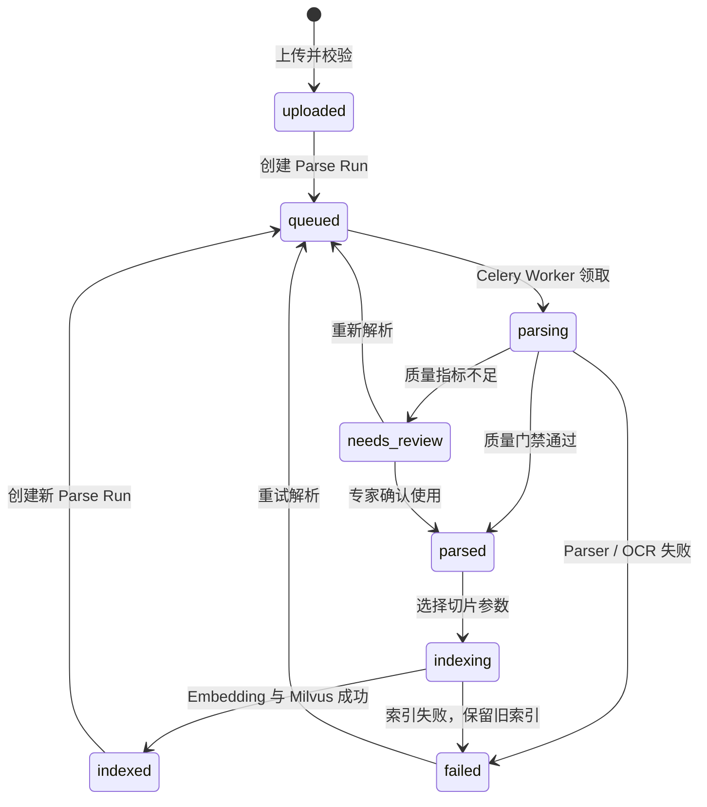

# AIAssistant 一期功能说明：RAG 问答、调试与评测闭环

这份文档面向第一次接触项目的人，说明一期 RAG 系统做了什么、页面怎么用、接口如何协作、数据库保存什么，以及为什么它能支撑后续 Agent 化。

## 1. 一期目标

一期目标不是先做复杂 Agent，而是先完成一个可靠、可调试、可评测、可回归的 RAG 知识库问答系统。

用户上传知识文档后，系统会先校验格式并异步解析为统一 Document IR，展示质量指标与逐页结构；解析通过或经专家确认后，再切成 chunk、生成 embedding，并建立 Milvus 向量索引。之后用户在右侧对话栏提问，系统会经过多轮问题改写、检索、融合、重排、压缩和大模型生成，最后用 SSE 流式返回答案。

一期最重要的价值是：系统不只回答问题，还保存“为什么这样回答”的完整证据链。

## 2. 用户能做什么

- 注册、登录。
- 创建知识库。
- 上传 TXT、Markdown、DOCX、PDF，并查看解析进度。
- 查看文本覆盖率、空白页、OCR 页、异常字符率和逐页 Block 预览。
- 对低质量解析结果确认使用或重新解析。
- 选择五种切片方式并预览页码、标题和段落来源。
- 一键索引文档。
- 基于知识库多轮问答。
- 查看流式回答和引用来源。
- 调整 RAG 参数并观察每一层结果变化。
- 查看每次问答 Trace。
- 维护评测集。
- 运行评测并查看报告。
- 对比评测 Run。
- 查看 Failure Analysis。
- 从 Trace、评测失败、用户负反馈沉淀 Regression Case。
- 查看模型调用次数、token、成本、慢请求、失败请求。
- 一键重置工作区。

## 3. 页面布局

前端主界面分三列：

- 左侧：知识库、文档上传、解析/索引状态和重置。
- 中间：调试工作台，包含 Debug、Evaluation、Datasets、History、Agent、Costs 等页签。
- 右侧：RAG 对话栏，支持 ChatSession、多轮消息、SSE 流式回答、引用来源、用户反馈。

其中一期重点是 Debug、Evaluation、Datasets、History、Costs 和右侧对话栏。

## 4. 一次 RAG 问答流程

```text
用户原始问题
-> Query Router 判断 internal_knowledge / web_required
-> 读取当前 ChatSession Summary 和最近 N 轮消息
-> Conversational Query Rewrite
-> Query Rewrite
-> Vector Search
-> BM25 Search
-> Hybrid Fusion (RRF)
-> Rerank
-> Context Compression
-> Final Prompt
-> LLM 流式回答
-> 保存 ChatMessage
-> 保存 RagTrace
```

### 多轮对话改写

系统现在支持短期会话上下文，不是跨会话长期记忆。

例如：

```text
上一轮：组织部的张伟是谁？
当前轮：他的工号是多少？
```

系统会先改写成适合检索的独立问题：

```text
组织部的张伟是谁？ 他的工号是多少？
```

如果配置了可用的 LLM rewrite key，会优先使用 LLM 把问题改写得更自然；失败时用规则兜底。

Trace 中会保存：

- `conversation_context`
- `conversation_rewrite_strategy`
- `standalone_query`
- `rewritten_query`


### Query Router

系统现在只做两类明确路由：

- `internal_knowledge`：内部知识库问题，进入 RAG 检索链路。
- `web_required`：需要联网、实时、最新信息的问题，当前先拒绝回答并提示未接入 Web Search。

其它问题会被视为不支持，避免系统把闲聊、通用创作或实时问题硬塞进知识库检索。

Trace 中会保存：

- `query_intent`
- `route_decision`
- `route_reason`

### 会话摘要记忆

短期上下文只看最近几轮，长对话会丢失更早的澄清信息。因此系统新增 `ChatSessionSummary` 表做中期记忆。

触发条件默认是：

```text
当前会话消息数 - summary_message_count >= 12
```

这个阈值由 `SESSION_SUMMARY_TRIGGER_MESSAGES` 配置。达到条件后，后端会启动后台线程调用便宜模型生成摘要，不阻塞用户看到流式回答。

后续问题改写会使用：

```text
会话摘要 + 最近几轮对话 + 当前问题
```

前端可以从两个地方验证：

- 右侧对话栏标题下方的“记忆摘要”状态。
- 中间 Debug 页的 `Conversation Memory` 区块。

## 5. 文档解析与质量门禁

文档上传和切片已经解耦。上传接口只负责校验、保存原文件并创建 `DocumentParseRun`；Celery Worker 从 Redis 获取任务，完成本地解析、逐页 OCR、统一 IR 持久化和质量判定。切片器只消费已完成或经专家确认的 Parse Run。

### 支持格式与校验

| 格式 | 默认解析器 | 结构信息 |
|---|---|---|
| TXT | `TextParser` | 编码、段落 |
| Markdown | `TextParser + markdown_page` | 标题路径、列表、代码块、表格 |
| DOCX | `DocxParser` | 标题样式、段落、列表、表格原始顺序 |
| PDF 文本页 | `PdfParser / PyMuPDF` | 页码、文本块、字体、bbox、标题推断 |
| PDF 扫描页 | `PaddleOcrClient` | OCR Markdown、原始页码、结构化 Blocks |

后端不会相信浏览器传来的 MIME。上传时会检查：

- 后缀白名单、文件签名和内部结构。
- 文件大小、PDF 页数和 PDF 是否加密。
- DOCX 解压后总体积、内部文件数量和异常压缩比。
- 文本编码、空文件、NUL 等二进制特征。

第一版不支持图片直传、HTML、PPTX、XLSX 和带密码 PDF。

### PDF 逐页 OCR

PyMuPDF 先解析每一页。原生有效字符少于阈值，或异常字符率超过阈值时，该页才会进入 OCR 候选集合。系统把候选页按原顺序生成临时子 PDF，通过 PaddleOCR Job API 提交一次任务，轮询完成后下载 JSONL，再映射回原 PDF 页码。

因此：

- 正常文本页不会发送到外部 OCR。
- 混合 PDF 不会整本重复识别。
- PaddleOCR 不可用时解析明确失败，不把扫描页当空白内容继续索引。
- Token、远程结果 URL 和临时文件不会进入业务日志或长期存储。

### 解析状态机



`DocumentParseRun` 的细粒度状态为 `queued/running/completed/needs_review/failed/superseded`。同一 Celery task ID 可以在 Worker 崩溃后恢复执行，不同任务不能并发覆盖；旧任务晚返回时会变成 `superseded`。

### 质量指标和前端操作

系统保存并展示：

- 文本覆盖率、原生文本覆盖率。
- 空白页、OCR 页和失败页比例。
- 异常字符率、总字符数、平均每页字符数。
- 解析器、解析器版本、任务进度和解析耗时。

默认门禁为：文本覆盖率不低于 90%、空白页比例不高于 10%、异常字符率不高于 2%，且不能有失败页。未通过时进入 `needs_review`，专家可逐页查看 Block 类型、标题路径、正文和解析方式，然后选择“确认使用解析结果”或“重新解析”。

## 6. 切片能力

支持五种切片方式：

- Token 切片。
- 句子切片。
- 句子窗口切片。
- 语义切片。
- Markdown 切片。

默认是句子切片。前端“文档解析与切片实验室”会先展示 Parse Run、质量指标和逐页 Blocks，再展示 chunk 内容、数量、token 数、页码、标题路径和段落范围。

索引后：

- SQLite `Chunk` 表保存 chunk 文本、元数据、embedding。
- Milvus Lite 保存向量索引。
- SQLite 是业务主数据，Milvus 索引可以重建。

## 7. 检索链路

### Vector Search

使用 embedding 做语义召回，适合语义相近但字面不完全一致的问题。

### BM25 Search

关键词检索，适合姓名、工号、部门、工具名、字段名等精确词。

### Hybrid Fusion

使用 RRF 把 Vector 和 BM25 候选合并，降低单一路径失败风险。

### Rerank

对 Hybrid Top N 重新排序，前端展示重排前后变化。

### Context Compression

对重排后的 chunk 再压缩，保留和问题最相关的句子。前端展示压缩前、压缩后、token 节省比例。

## 8. 调参能力

调试工作台支持：

- `chunk_size`
- Vector `top_k`
- BM25 `top_k`
- `RRF_K`
- Rerank `top_n`
- Compression 策略
- Query Rewrite 策略

用户调一次参数，就能重新问答或评测，观察每一层结果变化。

## 9. Trace 历史

每次问答保存 `RagTrace`，包括：

- 原始问题。
- 多轮上下文。
- 独立问题。
- 检索 query。
- Vector / BM25 / Hybrid / Rerank 结果。
- Compression 结果。
- Final Prompt。
- 最终回答。
- 参数快照。

History 页可以查看 Trace 列表、详情、对比，并把失败 Trace 沉淀成 Regression Case。

## 10. 评测集管理

系统维护 `RagBenchmarkCase`：

- `question`：问题。
- `reference`：参考答案。
- `expected_terms`：期望关键词。
- `target_chunk_ids`：标准答案所在 chunk，可为空。
- `suite`：`smoke`、`benchmark`、`regression`、`release`。
- `tags`：标签。
- `difficulty`：难度。
- `source`：专家维护、Trace 沉淀、Eval Failure、用户反馈、默认 JSON。
- `enabled`：是否启用。

推荐维护方式：

- `smoke`：少量冒烟用例，验证系统能跑。
- `benchmark`：专家维护的核心能力集。
- `regression`：历史失败沉淀出来，防止老问题复发。
- `release`：上线前必须通过的关键集合。

## 11. 评测报告

前端可以直接运行评测。后端创建 `RagEvalRun`，启动轻量后台线程，前端轮询状态。

评测结果保存在：

- `RagEvalRun`
- `RagEvalCaseResult`

报告展示：

- RAGAS 分数。
- Hit Rate。
- Recall@K。
- MRR。
- Vector 是否命中目标 chunk。
- BM25 是否命中目标 chunk。
- Hybrid 是否命中目标 chunk。
- Rerank 后是否保留目标 chunk。
- Compression 是否保留关键句。
- 最终回答是否正确。

还支持 Run 对比，用于比较不同参数组合。

### Eval Run stale 检测

评测 Run 由后台线程执行。若进程重启或线程异常退出，Run 可能长期停留在 `running`，导致前端轮询假死、Agent 无法选为 Baseline。

`backend/rag/eval_runs.py` 会在 list/retrieve/run 等路径调用 `reconcile_stale_eval_run()`：超过 `EVAL_RUN_STALE_TIMEOUT_SECONDS`（默认 3600 秒）仍为 `running` 的 Run 自动标记为 `failed`，并写入错误信息。

## 12. Failure Analysis

失败原因包括：

- `rewrite_failed`
- `vector_miss`
- `bm25_miss`
- `hybrid_drop`
- `rerank_drop`
- `compression_lost`
- `llm_answer_wrong`
- `no_reference`
- `target_chunk_stale`

这些原因来自链路阶段数据，不是只看最终答案主观判断。

## 13. 从失败到回归集

当前支持三类沉淀：

- 从 Trace 沉淀 Regression Case。
- 从 Eval Failure 沉淀 Regression Case。
- 从用户“没帮助”反馈沉淀 Regression Case。

所有写操作都会创建待确认动作，用户确认后才真正创建 Case。

## 14. 成本与模型监控

系统记录 `ModelCallLog`：

- 调用类型。
- 模型名。
- provider。
- prompt tokens。
- completion tokens。
- total tokens。
- 估算成本。
- 延迟。
- 成功或失败。
- 关联 session、message、trace、eval run。

Costs 页展示：

- 总调用次数。
- 总 token。
- 总成本。
- 各模型成本占比。
- 慢请求。
- 失败请求。
- 单次 Trace 成本。

## 15. 后端模块结构

RAG 主链路已从 `services.py` 拆分为职责更清晰的模块：

```text
backend/rag/
├── services.py         # facade，对外 re-export
├── chat_pipeline.py    # 问答编排（router、改写、检索、压缩、SSE）
├── retrieval.py        # vector / BM25 / hybrid / rerank
├── document_parsing/   # 统一 IR、本地 Parser、校验、PaddleOCR、解析服务
├── tasks.py            # Celery 文档解析任务
├── source_metadata.py  # 精细引用位置格式化
├── indexing.py         # Parse Run 切片、Embedding、索引原子切换
├── session_memory.py   # ChatSessionSummary 异步生成
├── hybrid.py           # RRF 融合
├── query_router.py     # internal_knowledge / web_required
├── query_rewrite.py    # 检索 query 改写
├── eval_runs.py        # Eval Run stale 检测
└── case_factory.py     # Regression Case 沉淀
```

## 16. 核心路径测试

`backend/rag/tests/` 提供 P0 单元测试，覆盖最容易 silent regression 的纯函数逻辑：

- `test_hybrid.py`：RRF 融合、同 chunk 双源合并、`top_k` 截断、缺 rank 兜底。
- `test_query_router.py`：空问题、联网/实时、闲聊、知识库问题、改写后 query 路由。
- `test_document_parsing.py`：TXT/Markdown/DOCX/PDF、逐页 OCR、IR provenance、质量门禁、任务租约和旧索引保护。
- `test_document_api.py`：上传校验、自动排队、解析预览、人工确认与切片解锁。
- `test_paddleocr.py`：Job 提交、状态轮询和 JSONL 下载协议。

运行：

```bash
cd backend
source venv/bin/activate
pytest rag/tests -q
```

GitHub Actions（`.github/workflows/backend-tests.yml`）在 `backend/**` 变更时自动运行 compileall、Django check、makemigrations --check 与 pytest。

## 17. 核心 API

```text
POST /api/auth/register/
POST /api/auth/login/
GET  /api/auth/me/

/api/knowledge-bases/
/api/documents/
POST /api/documents/{id}/parse/
GET  /api/documents/{id}/parse-status/
GET  /api/documents/{id}/parse-preview/?page=N
POST /api/documents/{id}/accept-parse/
POST /api/documents/{id}/chunk-preview/
POST /api/documents/{id}/index/
GET  /api/chunk-methods/

/api/chat-sessions/
GET  /api/chat-sessions/{id}/messages/
POST /api/chat-sessions/{id}/messages/
POST /api/chat-sessions/{id}/stream/

/api/rag-traces/
/api/rag-benchmark-cases/
/api/rag-eval-runs/
POST /api/rag-eval-runs/run/

/api/rag-user-feedback/
GET  /api/model-usage/summary/
POST /api/reset-workspace/
```

## 18. 数据库保存什么

SQLite 保存：

- `KnowledgeBase`
- `Document`：原文件、真实 MIME、大小、SHA-256 和当前处理状态。
- `DocumentParseRun`：异步任务、解析器版本、进度、质量、错误和 Paddle Job ID。
- `DocumentPage`：页码、原生/OCR 来源、Markdown、纯文本和统一 Blocks。
- `Chunk`：内容、Embedding、Parse Run 和页码/标题/段落 provenance。
- `ChatSession`
- `ChatMessage`
- `ChatSessionSummary`：长对话会话摘要、中期记忆状态、覆盖消息数和摘要生成状态。
- `RagTrace`
- `RagBenchmarkCase`
- `RagEvalRun`
- `RagEvalCaseResult`
- `RagUserFeedback`
- `ModelCallLog`

Milvus Lite 保存向量索引。

## 19. 启动和验证

后端：

```bash
cd /home/peng/AIAssistant/backend
source venv/bin/activate
python manage.py migrate
python manage.py runserver 127.0.0.1:8010
```

Redis 与解析 Worker：

```bash
sudo service redis-server start
cd /home/peng/AIAssistant/backend
source venv/bin/activate
celery -A assistant_backend worker --loglevel=INFO --concurrency=1
```

前端：

```bash
cd /home/peng/AIAssistant/frontend
npm install
npm run dev -- --host 0.0.0.0 --port 5174
```

验证：

```bash
cd /home/peng/AIAssistant/backend
source venv/bin/activate
python -m compileall rag assistant_backend
python manage.py check
python manage.py makemigrations --check --dry-run
pytest rag/tests -q
```

```bash
cd /home/peng/AIAssistant/frontend
npm run build
```

## 20. 一期总结

一期完成的是 RAG 工程底座：

- 支持多格式文档解析、质量门禁和精细引用。
- 可问答。
- 可调试。
- 可评测。
- 可回归。
- 可观测成本。
- 支持多轮短期上下文与中会话摘要。
- Eval Run stale 自动兜底。
- RRF / Query Router 核心路径测试 + CI。

它为二期 Agent 工作流提供了可靠的数据、工具和评测底座。
